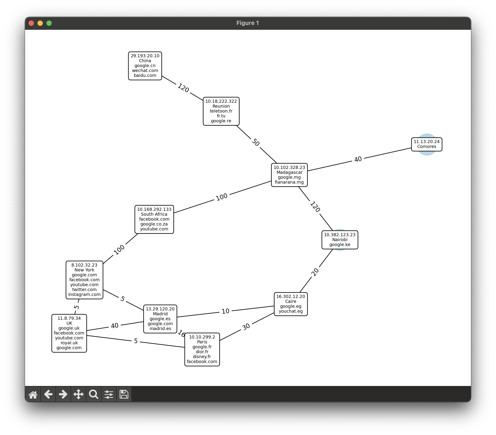

# Overview 🔮

Implementation of Dijkstra's algorithm with a network connection for retrieving the shortest path to a web server.


https://github.com/mendrika261/S3-ALGO-Network/assets/97053149/7b2a5d7c-924e-4afa-a16e-fa95ca48424c


## Functionality 🛠️
- Draw graph of the network

- Find the shortest path from a server to a web server
- Signaling malfunctioning connections
- Add new connections to the network
- Add a server

## How to use ℹ️
- Create a virtual environment
```bash
python3 -m venv venv
```
- Activate the virtual environment
```bash
source venv/bin/activate
```
- Install the requirements
```bash
pip install -r requirements.txt
```
- Run the program
```bash
python3 main.py
```
